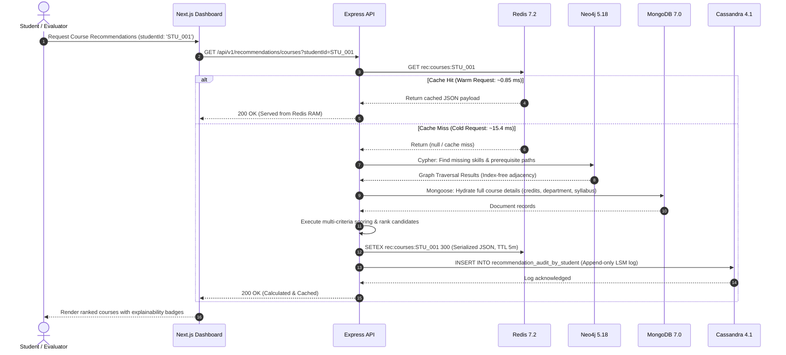

# System Architecture

> **Campus Resource Dependency and Personalized Recommendation Graph**  
> *A Polyglot Multi-Model Architecture for Academic Intelligence & Resource Navigation*

---

## 1. Architectural Philosophy: Polyglot Persistence

Modern campus resource intelligence involves diverse operational characteristics that cannot be effectively served by a single database engine:
1. **Heterogeneous, Polymorphic Entities**: Students, courses, research projects, student clubs, and campus facilities possess evolving attributes best stored as flexible semi-structured JSON/BSON documents.
2. **Deep Recursive Dependency Chains**: Course prerequisites, skill hierarchies, and career qualification pathways form a directed acyclic graph (DAG) where recursive pointer traversals must execute with index-free adjacency.
3. **Sub-Millisecond Read Acceleration**: Frequently accessed recommendation portfolios and student profiles must be served with sub-millisecond latencies to ensure an interactive user experience.
4. **Append-Heavy Time-Series Telemetry**: Student interaction events, facility access logs, and recommendation audit trails generate high-frequency writes requiring append-optimized write paths without lock contention.

Rather than forcing relational join impedance mismatch or single-model compromises (*"One Size Does Not Fit All"*), this platform integrates **four specialized NoSQL database engines** into a coherent architecture.

---

## 2. System Architecture Diagram

```mermaid
graph TB
    subgraph Client Tier ["Client Presentation Tier (Browser)"]
        UI["Next.js 14 Web Application\n(React 18, TailwindCSS, React Flow, Recharts)"]
    end

    subgraph Gateway Tier ["Application & Routing Tier"]
        API["Node.js / Express API Service (:5000)\n(TypeScript, Zod Validation, Async Error Handlers)"]
        RateLimit["Sliding Window Rate Limiter\n(Redis-backed / In-memory fallback)"]
        Obs["Latency & Observability Logger\n(High-resolution performance.now())"]
    end

    subgraph Service Tier ["Core Business Services"]
        RecEngine["Recommendation Engine\n(Graph overlap scoring & topological sorting)"]
        SyncService["Sync Coordinator\n(Mongo -> Neo4j -> Redis -> Cassandra)"]
        CacheService["Cache-Aside Layer\n(Key-Value TTL & Invalidation)"]
        ActivityService["Telemetry Service\n(Time-series partitioner)"]
        DemoService["NoSQL Educational Demos\n(8 Live & Simulated Modules)"]
    end

    subgraph Persistence Tier ["Polyglot NoSQL Persistence Tier"]
        MongoDB[("MongoDB 7.0\nDocument Store (:27017)\n• Source of Truth\n• Nested Entity Schemas\n• Aggregation Pipelines")]
        Neo4j[("Neo4j 5.18\nGraph Store (:7687)\n• Prerequisite DAGs\n• Index-Free Adjacency\n• BFS Shortest Paths")]
        Redis[("Redis 7.2\nIn-Memory Store (:6379)\n• Sub-ms Cache-Aside\n• volatile-lru Eviction\n• Sliding-Window Counters")]
        Cassandra[("Apache Cassandra 4.1\nWide-Column Store (:9042)\n• Append-Heavy Telemetry\n• Murmur3 Token Partitioning\n• Clustered Time-Series")]
    end

    UI -->|HTTP / JSON Requests| Gateway Tier
    Gateway Tier --> RateLimit
    RateLimit --> Obs
    Obs --> Service Tier

    RecEngine -->|1. Cache Probe| Redis
    RecEngine -->|2. Multi-hop Traversal| Neo4j
    RecEngine -->|3. Entity Hydration| MongoDB
    RecEngine -->|4. Audit Log Append| Cassandra

    SyncService -->|Write Source of Truth| MongoDB
    SyncService -->|Invalidate Keys| Redis
    SyncService -->|Upsert Nodes & Edges| Neo4j
    SyncService -->|Log Sync Event| Cassandra

    CacheService --> Redis
    ActivityService --> Cassandra
    DemoService --> Persistence Tier
```

---

## 3. End-to-End Data Flow Diagram



---

## 4. Multi-Store Specialization Matrix

| Database Engine | Primary Responsibility | Data Model | Computational Strength | Access Pattern Complexity |
| :--- | :--- | :--- | :--- | :---: |
| **MongoDB 7.0** | Master entity definitions & catalog metadata | Hierarchical BSON Documents | Schema flexibility, nested structures, secondary indexes, aggregation rollups | $O(\log N)$ B-Tree index seeks; $O(N)$ unindexed scans |
| **Neo4j 5.18** | Relationship topology, dependency chains & paths | Labeled Property Graph (LPG) | Index-free adjacency, recursive variable-length traversals, BFS shortest path | $O(k)$ per node hop, independent of total database size |
| **Redis 7.2** | High-velocity caching & rate limiting | In-memory key-value dictionary | Zero disk I/O, sub-millisecond retrieval, deterministic memory eviction | $O(1)$ constant time hash lookups |
| **Cassandra 4.1** | Immutable activity logs & time-series audit events | Wide-column distributed tables | High-throughput sequential disk writes (CommitLog + Memtable), horizontal linear scale | $O(1)$ token partition seek + sequential SSTable scan |

---

## 5. Fail-Safe Degradation Matrix (Circuit Breakers)

The platform implements layered fault isolation ensuring that a failure in one database engine never causes catastrophic system failure:

```
[System Priority Hierarchy]
MongoDB (Critical: Tier 1)  >  Neo4j (Important: Tier 2)  >  Redis (Performance: Tier 3)  >  Cassandra (Telemetry: Tier 4)
```

| Failing Engine | Criticality Tier | Failure Impact | Implemented Graceful Fallback |
| :--- | :---: | :--- | :--- |
| **MongoDB** | **Tier 1 (Critical)** | Entity metadata unavailable for writes. | Point reads served from warm Redis cache if present. Write requests return HTTP 503 with helpful status. |
| **Neo4j** | **Tier 2 (Important)** | Multi-hop graph traversals unavailable. | Recommendation engine degrades to rule-based document overlap scoring via MongoDB; student profiles remain accessible. |
| **Redis** | **Tier 3 (Performance)** | Cache acceleration unavailable. | `safeExec` wrapper catches connection errors; queries bypass cache and read directly from primary stores with latency logging. |
| **Cassandra** | **Tier 4 (Telemetry)** | Activity logging and telemetry unavailable. | Events are captured in an in-memory fallback buffer array; user-facing reads and recommendation flows continue with zero interruption. |
