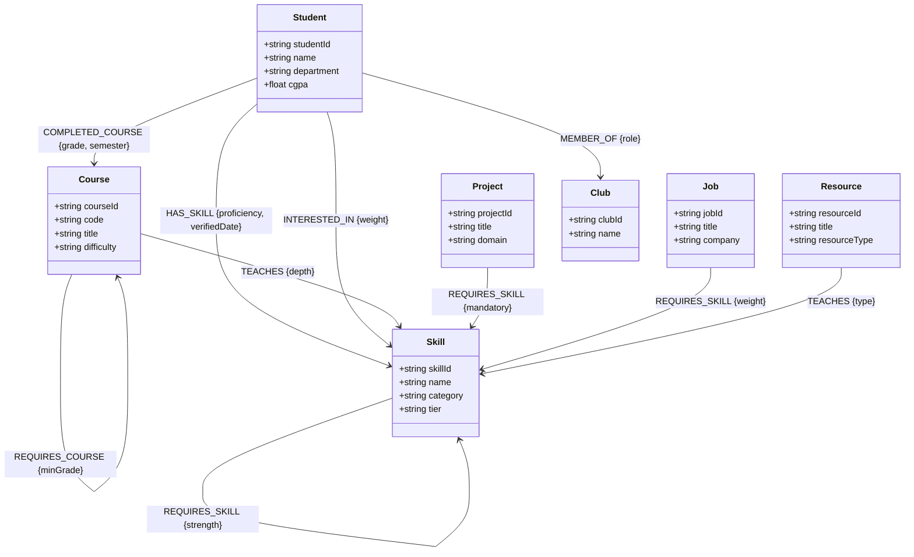
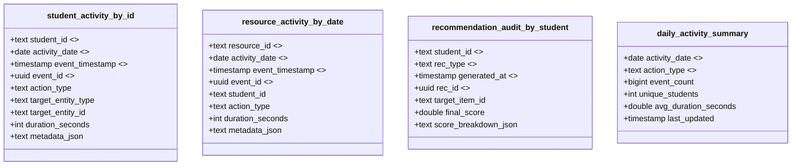
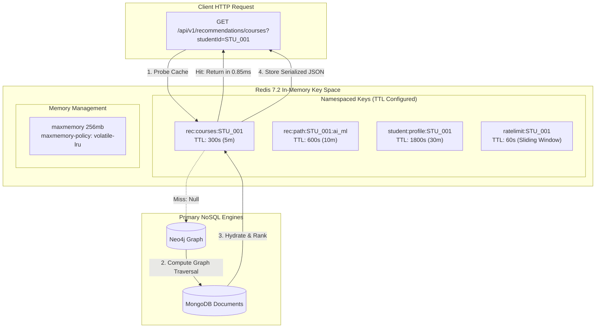

# Multi-Model Database Design Specification

> **Campus Resource Dependency and Personalized Recommendation Graph**  
> *Detailed Physical & Logical Schema Specifications Across 4 Polyglot NoSQL Databases*

---

## 1. MongoDB Document Model Design

MongoDB acts as the primary system of record for all campus entities. Entity records are stored as rich, semi-structured BSON documents with embedded sub-documents and arrays.

### 1.1 MongoDB Schema Diagram

```mermaid
erDiagram
    STUDENTS ||--o{ VERIFIED_SKILLS : contains
    STUDENTS ||--o{ COMPLETED_COURSES : contains
    STUDENTS ||--o{ CLUB_MEMBERSHIPS : contains
    STUDENTS {
        string studentId PK "Indexed Unique (e.g. STU_001)"
        string name "Student full name"
        string rollNumber "University roll number"
        string email "Institutional email"
        string department "Academic department"
        int currentSemester "Semester 1-8"
        double cgpa "Cumulative GPA (0.0-10.0)"
        array interests "Array of topical interest strings"
        array verifiedSkills "Embedded skill objects with proficiency"
        array completedCourses "Embedded completed course history"
        array clubMemberships "Embedded club participation"
        date createdAt "Creation timestamp"
        date updatedAt "Modification timestamp"
    }

    COURSES {
        string courseId PK "Indexed Unique (e.g. crs_cs101)"
        string code "Course code (e.g. CS101)"
        string title "Course title"
        string department "Offering department"
        int credits "Credit weighting"
        string difficulty "introductory | intermediate | advanced"
        string syllabus "Syllabus outline text"
        array taughtSkillIds "Skill foreign keys taught"
        array prerequisiteCourseIds "Required prerequisite course codes"
    }

    SKILLS {
        string skillId PK "Indexed Unique (e.g. sk_python)"
        string name "Skill standard name"
        string category "Domain category"
        string tier "foundational | intermediate | advanced"
        array directPrerequisiteSkillIds "Skill dependency foreign keys"
    }

    PROJECTS {
        string projectId PK "Indexed Unique (e.g. prj_nlp)"
        string title "Project title"
        string domain "Application domain"
        string difficulty "Difficulty tier"
        array requiredSkillIds "Required skill prerequisites"
        array techStack "Tools and frameworks used"
    }

    JOBS {
        string jobId PK "Indexed Unique (e.g. job_ml)"
        string title "Job title"
        string company "Hiring organization"
        string employmentType "full-time | internship"
        array requiredSkillIds "Mandatory skill foreign keys"
        double minCgpa "Minimum qualification threshold"
    }

    RESOURCES {
        string resourceId PK "Indexed Unique (e.g. res_gpu_01)"
        string title "Resource name"
        string resourceType "gpu_cluster | textbook | library"
        string location "Campus physical or virtual endpoint"
        int accessCount "Cumulative usage counter"
        double rating "Average student rating (1.0-5.0)"
    }
```



### 1.2 MongoDB Indexes
| Collection | Index Fields | Type | Purpose |
| :--- | :--- | :---: | :--- |
| `students` | `{ studentId: 1 }` | Unique B-Tree | High-speed $O(\log N)$ point lookups |
| `students` | `{ department: 1, currentSemester: 1 }` | Compound | Fast student filtering by cohort |
| `courses` | `{ courseId: 1 }`, `{ code: 1 }` | Unique B-Tree | Catalog lookups |
| `skills` | `{ skillId: 1 }`, `{ category: 1 }` | Compound | Skill catalog filtering |
| `projects` | `{ projectId: 1 }`, `{ domain: 1 }` | Compound | Project recommendation indexing |
| `jobs` | `{ jobId: 1 }`, `{ title: "text" }` | Text Index | Full-text job searches |
| `resources` | `{ resourceId: 1 }`, `{ resourceType: 1 }` | Compound | Resource filtering and sorting |

---

## 2. Neo4j Graph Schema Design

Neo4j models the relationships, prerequisite chains, and career dependencies as a directed, labeled property graph where relationships are traversed in $O(1)$ time per pointer hop (index-free adjacency).

### 2.1 Neo4j Graph Schema Diagram



### 2.2 Cypher Node Constraints & Indexes
```cypher
// Unique node constraints (create implicit B-tree index)
CREATE CONSTRAINT FOR (s:Student) REQUIRE s.studentId IS UNIQUE;
CREATE CONSTRAINT FOR (c:Course) REQUIRE c.courseId IS UNIQUE;
CREATE CONSTRAINT FOR (sk:Skill) REQUIRE sk.skillId IS UNIQUE;
CREATE CONSTRAINT FOR (p:Project) REQUIRE p.projectId IS UNIQUE;
CREATE CONSTRAINT FOR (j:Job) REQUIRE j.jobId IS UNIQUE;
CREATE CONSTRAINT FOR (r:Resource) REQUIRE r.resourceId IS UNIQUE;

// Secondary property search indexes
CREATE INDEX FOR (s:Student) ON (s.department);
CREATE INDEX FOR (sk:Skill) ON (sk.category);
```

---

## 3. Apache Cassandra Wide-Column Telemetry Model

Cassandra stores append-heavy, high-throughput time-series interaction events and recommendation audits. In Cassandra, schemas are strictly designed around **query access patterns** rather than entity normalization.

### 3.1 Cassandra Data Model Diagram



### 3.2 Access Patterns Served by Cassandra Tables
1. **Query Pattern 1 (`student_activity_by_id`)**:
   - *Query*: Retrieve recent chronological interactions for student $S$ on date $D$.
   - *CQL*: `SELECT * FROM student_activity_by_id WHERE student_id = ? AND activity_date = ? LIMIT 50;`
   - *Execution*: Hashes `student_id` via Murmur3 to locate single storage node; reads clustered rows in reverse chronological order via disk SSTable sequential scan.
2. **Query Pattern 2 (`resource_activity_by_date`)**:
   - *Query*: Fetch telemetry for a campus lab or textbook on date $D$.
   - *CQL*: `SELECT * FROM resource_activity_by_date WHERE resource_id = ? AND activity_date = ?;`
3. **Query Pattern 3 (`recommendation_audit_by_student`)**:
   - *Query*: Audit historical recommendations and explainability scores generated for student $S$.
   - *CQL*: `SELECT * FROM recommendation_audit_by_student WHERE student_id = ? AND rec_type = ? LIMIT 20;`

---

## 4. Redis In-Memory Caching Architecture

Redis acts as the sub-millisecond cache-aside layer and sliding-window rate limiter, sitting in front of MongoDB and Neo4j.

### 4.1 Redis Caching Diagram



### 4.2 Redis Key Invalidation Strategy
* **Cache Expiration**: Every cached key is configured with a deterministic Time-To-Live (TTL):
  - Recommendations: $300\text{ s}$ ($5\text{ minutes}$)
  - Learning Paths: $600\text{ s}$ ($10\text{ minutes}$)
  - Entity Profiles: $1800\text{ s}$ ($30\text{ minutes}$)
* **Proactive Invalidation on Mutation**: When a student verifies a new skill or completes a course in MongoDB, the `syncService` triggers `DEL rec:courses:STU_001`, `DEL rec:path:STU_001:*`, and `DEL student:profile:STU_001`. This ensures immediate consistency for the user without waiting for TTL expiry.
