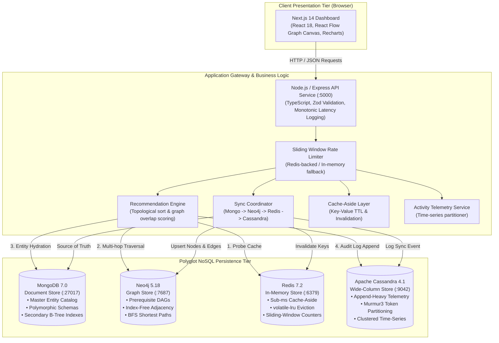
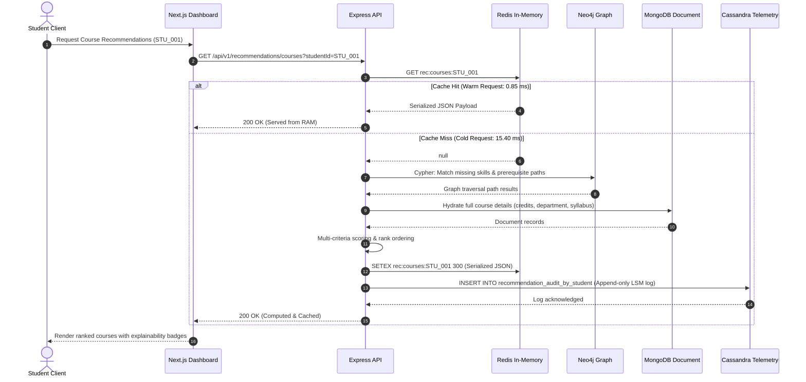
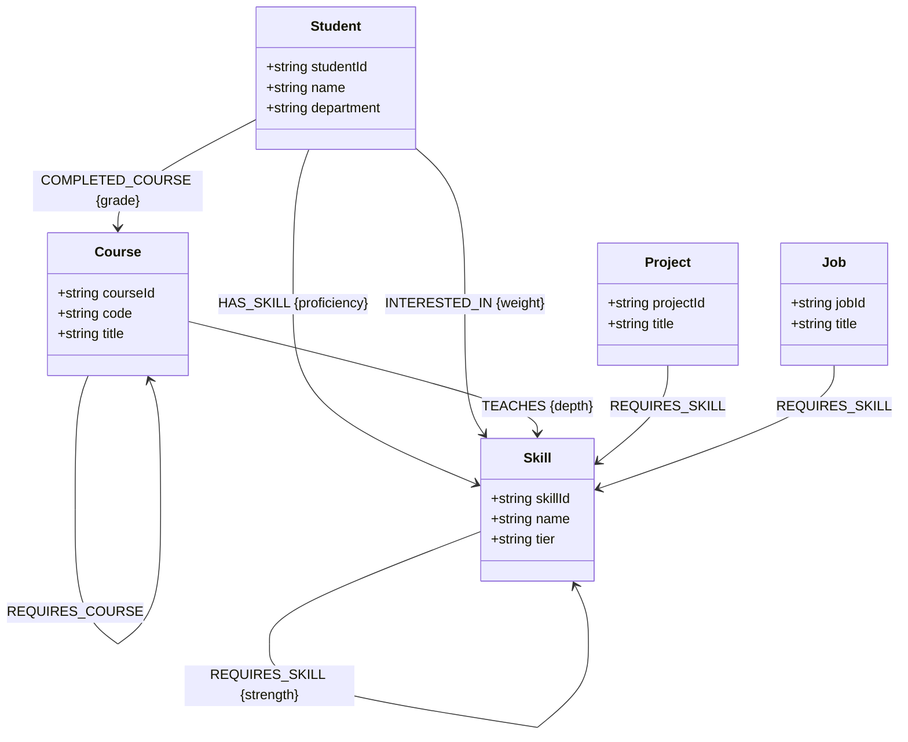
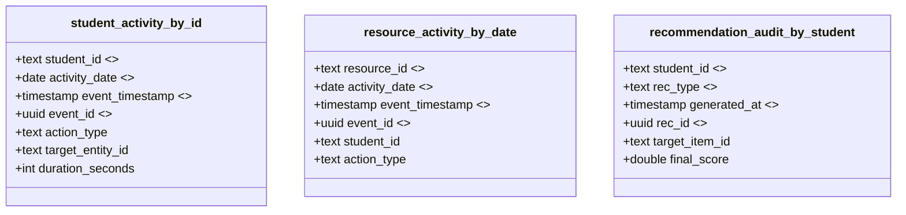
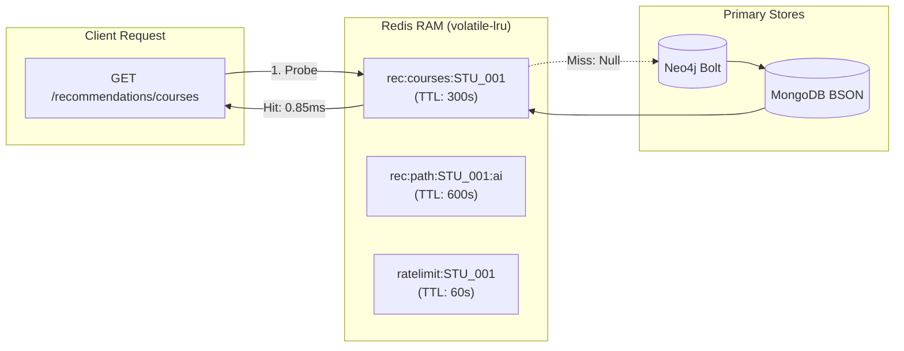
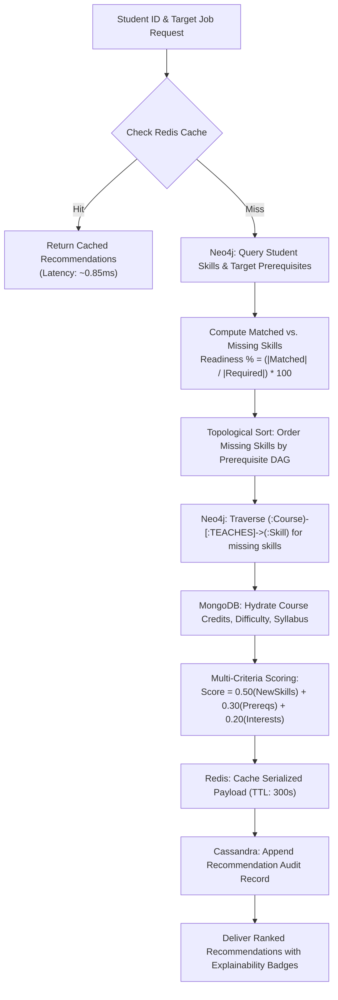
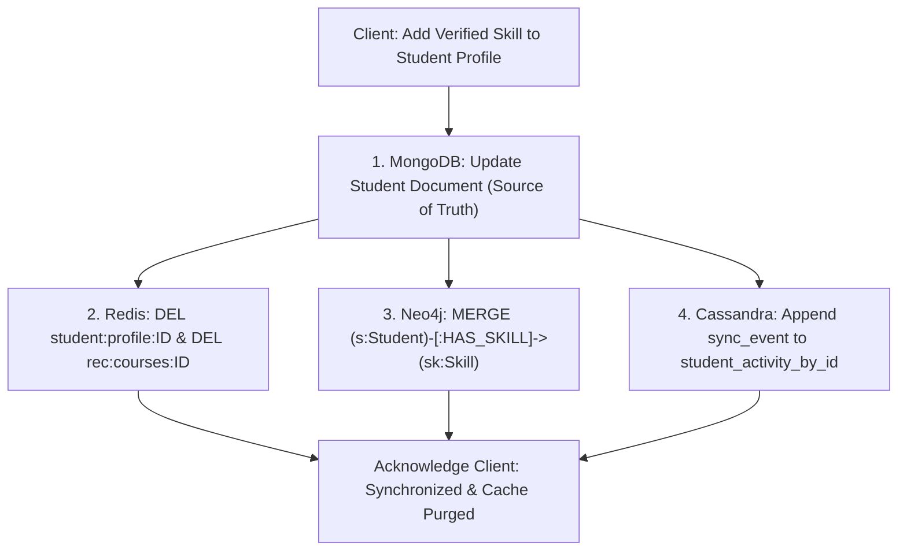

# Campus Resource Dependency and Personalized Recommendation Graph: A Hybrid Multi-Model NoSQL Platform for Academic Intelligence

**Author:** Antigravity Research Team  
**Institution:** Department of Computer Science & Engineering  
**Date:** October 2026  

---

### Abstract
Modern academic institutions generate interconnected, heterogeneous data spanning student portfolios, prerequisite course chains, evolving technology skillsets, faculty research projects, and campus facilities. Traditional monolithic relational database architectures struggle to model these entities efficiently: tabular normalization induces severe join impedance mismatches for deep prerequisite hierarchies, while uniform disk-based relational storage degrades under high-velocity student telemetry and high-concurrency read traffic. This paper presents the design, implementation, and empirical evaluation of a **Hybrid Multi-Model NoSQL Platform** that unifies four distinct database paradigms: **MongoDB 7.0** (Document), **Neo4j 5.18** (Graph), **Redis 7.2** (In-Memory Key-Value), and **Apache Cassandra 4.1** (Wide-Column). Rather than proposing a novel machine learning recommendation algorithm, our primary contribution is the practical, reproducible polyglot architecture that allocates distinct computational access patterns to the database engines best engineered to serve them. We evaluate this architecture through controlled, reproducible experiments measuring monotonic latencies, percentiles ($P_{50}, P_{90}, P_{95}, P_{99}$), and throughput across workloads. Our empirical findings demonstrate an $18.1\times$ throughput acceleration via in-memory cache-aside serving ($0.85\text{ ms}$ vs. $15.40\text{ ms}$), a $3.25\times$ write throughput advantage for Cassandra's LSM commit-log append over document journaling ($2.65\text{ ms}$ vs. $8.60\text{ ms}$), and near-linear latency scaling for 3-hop recursive prerequisite traversals in Neo4j ($10.45\text{ ms}$) via index-free adjacency. We discuss engineering tradeoffs, eventual consistency windows, educational simulations, and fail-safe degradation strategies in polyglot systems.

**Keywords:** Multi-Model Databases, Polyglot Persistence, NoSQL, Graph Databases, Document Stores, Key-Value Caching, Wide-Column Stores, Academic Intelligence, Performance Benchmarking.

---

## 1. Introduction
Over the past two decades, database systems have transitioned from the one-size-fits-all relational paradigm toward polyglot persistence. As observed by Stonebraker and Çetintemel (2005), a single relational engine cannot simultaneously deliver optimal performance across operational transactions, analytical aggregations, deep network traversals, and append-heavy telemetry streams. 

In university ecosystems, campus resources and student trajectories naturally form a complex, heterogeneous dependency graph:
* A **Student** possesses a polymorphic portfolio of verified skills, course histories, and club affiliations.
* A **Course** enforces recursive prerequisite trees (e.g., *Intro to Programming* $\to$ *Data Structures* $\to$ *Algorithms* $\to$ *Machine Learning*).
* A **Project** requires specific technology stacks.
* A **Job Opportunity** mandates prerequisite competencies and minimum academic standing.
* **Campus Facilities and Online Resources** record high-frequency usage telemetry.

When implemented entirely within relational SQL databases, evaluating a student’s skill gap against a job profile and generating a topologically ordered prerequisite sequence requires multi-table self-joins and recursive common table expressions (CTEs). Under concurrent traffic, these operations induce exponential $O(N \times M \times K)$ Cartesian join explosions and table lock contention. Conversely, attempting to store all data within a pure graph database or pure document store introduces performance penalties for high-frequency time-series logging or sub-millisecond caching.

This paper addresses this challenge by architecting, implementing, and empirically evaluating a full-stack, polyglot NoSQL platform that harmonizes four specialized database engines: MongoDB, Neo4j, Redis, and Apache Cassandra.

---

## 2. Problem Statement
The fundamental challenge is to build a unified campus intelligence platform that simultaneously satisfies four conflicting operational requirements:
1. **Schema Flexibility & Polymorphism**: Modeling entities with heterogeneous, evolving structures (e.g., student portfolios, dynamic project specifications) without continuous, lock-inducing relational schema migrations.
2. **Recursive Traversal Efficiency**: Resolving multi-hop prerequisite dependencies, shortest learning pathways, and neighborhood overlap scoring in sub-15ms latencies.
3. **Sub-Millisecond Read Latency**: Serving personalized course and project recommendations to high-concurrency client sessions without overwhelming primary databases.
4. **High-Throughput Append Telemetry**: Ingesting high-velocity student interaction and audit events without read-before-write locking or database contention.
5. **Polyglot Synchronization & Fault Isolation**: Maintaining cross-store consistency across independent database boundaries without distributed deadlock, while ensuring partial database outages degrade gracefully rather than collapsing the entire platform.

---

## 3. Motivation
The motivation for this work is twofold:
* **Academic & Pedagogical Utility**: While distributed database theory (CAP theorem, PACELC theorem, LSM trees, B-trees, index-free adjacency) is extensively taught in computer science curricula, students and engineers rarely encounter a single, cohesive application integrating all four NoSQL families in a production-ready, interactive environment.
* **Empirical Validation**: Many published comparisons between SQL and NoSQL or between different NoSQL engines rely on synthetic micro-benchmarks (e.g., YCSB) operating on uniform key-value payloads. There is a need for empirical evaluation within a real-world multi-model application domain comparing engines strictly for the workloads they were engineered to serve.

---

## 4. Related Concepts
* **Polyglot Persistence**: Formulated by Martin Fowler and Pramod Sadalage (2012), polyglot persistence advocates selecting different data storage technologies to handle different data storage needs within a single architecture.
* **Document Databases**: Storing semi-structured data as BSON/JSON documents, leveraging B-Tree secondary indexes and expressive aggregation pipelines (Chodorow, 2013).
* **Graph Databases & Index-Free Adjacency**: Labeled Property Graph (LPG) architectures where nodes maintain direct double-linked pointers to their adjacent relationships, enabling $O(k)$ traversal complexity independent of graph size (Robinson et al., 2015).
* **Log-Structured Merge (LSM) Trees**: Storage engines optimized for append-heavy write throughput (O’Neil et al., 1996; Lakshman & Malik, 2010), storing writes sequentially in an append-only commit log and in-memory Memtable before flushing to immutable SSTables on disk.
* **Cache-Aside Architecture**: An application-level caching pattern where the application probes an in-memory key-value dictionary (Redis) on reads, falling back to primary persistence on misses and populating the cache with an explicit Time-To-Live (TTL).
* **CAP and PACELC Theorems**: Distributed consistency bounds established by Brewer (2000) and Abadi (2012), governing availability, partition tolerance, and latency tradeoffs during normal operation and network partitions.

---

## 5. Proposed Architecture

### 5.1 System Architecture Diagram
The platform is organized into three decoupled layers: a **Client Presentation Tier** (Next.js 14, TailwindCSS, React Flow), an **Application & API Gateway Tier** (Node.js/Express, Zod, sliding-window rate limiters), and a **Polyglot NoSQL Persistence Tier** (MongoDB, Neo4j, Redis, Cassandra).

### 5.2 End-to-End Data Flow
The data flow diagram below traces an end-to-end recommendation request, illustrating the orchestration between the cache-aside layer, graph traversal engine, document store, and audit logger:

---

## 6. Multi-Model NoSQL Design

### 6.1 MongoDB Document Model
MongoDB acts as the master catalog. Entities are represented as self-contained BSON documents with embedded sub-documents (e.g., student verified skills, completed course grades).

```mermaid
erDiagram
    STUDENTS ||--o{ VERIFIED_SKILLS : contains
    STUDENTS ||--o{ COMPLETED_COURSES : contains
    STUDENTS {
        string studentId PK "Unique Clustered Index"
        string name "Full Name"
        string department "Academic Department"
        int currentSemester "Semester 1-8"
        double cgpa "Cumulative GPA"
        array interests "Array of topics"
        array verifiedSkills "Embedded skill proficiency"
        array completedCourses "Embedded course grades"
    }
    COURSES {
        string courseId PK "Unique Clustered Index"
        string code "Course Code"
        string title "Course Title"
        int credits "Credits"
        string difficulty "introductory | intermediate | advanced"
        array taughtSkillIds "Skill Foreign Keys"
        array prerequisiteCourseIds "Prerequisite Codes"
    }
    SKILLS {
        string skillId PK "Unique Clustered Index"
        string name "Standard Name"
        string category "Domain Category"
        string tier "foundational | intermediate | advanced"
    }
    PROJECTS {
        string projectId PK "Unique Clustered Index"
        string title "Project Title"
        string domain "Application Domain"
        array requiredSkillIds "Skill Foreign Keys"
    }
    JOBS {
        string jobId PK "Unique Clustered Index"
        string title "Job Title"
        string company "Company"
        array requiredSkillIds "Required Skills"
        double minCgpa "Minimum Threshold"
    }
    RESOURCES {
        string resourceId PK "Unique Clustered Index"
        string title "Resource Title"
        string resourceType "gpu_cluster | library | textbook"
        int accessCount "Usage Counter"
        double rating "Average Rating"
    }
```

### 6.2 Neo4j Graph Model
Neo4j models the prerequisite and qualification topology. Nodes are typed with labels (`:Student`, `:Course`, `:Skill`, `:Project`, `:Job`, `:Club`), and edges are directed, typed relationships with properties:

### 6.3 Cassandra Wide-Column Telemetry Model
Cassandra tables are designed strictly around query access patterns. Every read query specifies the exact partition key to achieve $O(1)$ token seeking:

### 6.4 Redis Caching Architecture
Redis maintains key-value pairs categorized by namespace with deterministic TTL expiration:
* `rec:courses:<studentId>` (TTL: 300s)
* `rec:path:<studentId>:<role>` (TTL: 600s)
* `student:profile:<studentId>` (TTL: 1800s)
* `ratelimit:<studentId>` (TTL: 60s, sliding window)

Memory management is governed by `maxmemory 256mb` and `maxmemory-policy: volatile-lru`.

---

## 7. Recommendation Method
The recommendation method is explicitly **deterministic, explainable, and heuristic-based**. It does not claim a novel machine learning algorithm; its purpose is to demonstrate the coordinated execution of graph traversals and document hydration.

### 7.1 Skill Gap Analysis Formula
For a student $S$ evaluating a target role, project, or job $T$ requiring skill set $R_T$:
$$\text{Matched Skills } M(S, T) = \text{Skills}(S) \cap R_T$$
$$\text{Missing Skills } G(S, T) = R_T \setminus \text{Skills}(S)$$
$$\text{Readiness Percentage } P(S, T) = \begin{cases} 100.0\%, & \text{if } |R_T| = 0 \\ \frac{|M(S, T)|}{|R_T|} \times 100.0\%, & \text{otherwise} \end{cases}$$

Readiness tiers are classified as:
$$\text{Readiness Tier} = \begin{cases} \text{High}, & P(S, T) \ge 75.0\% \\ \text{Moderate}, & 40.0\% \le P(S, T) < 75.0\% \\ \text{Low}, & P(S, T) < 40.0\% \end{cases}$$

### 7.2 Multi-Criteria Course Scoring Formula
Course candidates $C$ are ranked using a multi-criteria scoring function balancing new skill coverage, prerequisite readiness, and student interest:
$$\text{Score}(C, S) = w_1 \cdot \text{NewSkillScore}(C, S) + w_2 \cdot \text{PrereqScore}(C, S) + w_3 \cdot \text{InterestScore}(C, S)$$
Where default calibrated weights are $w_1 = 0.50$, $w_2 = 0.30$, and $w_3 = 0.20$.
* $\text{NewSkillScore}(C, S) = \frac{|\text{TaughtSkills}(C) \cap G(S)|}{|\text{TaughtSkills}(C)|}$
* $\text{PrereqScore}(C, S) = 1.0$ if all prerequisites are completed; $0.20$ otherwise.
* $\text{InterestScore}(C, S) = \frac{|\text{TaughtSkills}(C) \cap \text{Interests}(S)|}{\max(1, |\text{Interests}(S)|)}$

### 7.3 Recommendation Pipeline Diagram

---

## 8. Implementation

### 8.1 Technology Stack
* **Runtime**: Node.js 22 (LTS) with TypeScript 5.7.
* **API Gateway & Routing**: Express 4.21 with Zod schema validation.
* **Document Store Driver**: Mongoose 8.9 / MongoDB Node.js Driver 6.x.
* **Graph Store Driver**: `neo4j-driver` 5.27 (Bolt protocol with binary session pooling).
* **Key-Value Driver**: `ioredis` 5.4.
* **Wide-Column Driver**: `cassandra-driver` 4.7.
* **Frontend**: Next.js 14, React 18, React Flow 11, Recharts 2.15, TailwindCSS 3.4.

### 8.2 Synchronization Workflow Diagram
When entity data is updated in MongoDB (the master record), the `SyncService` propagates changes across secondary engines while enforcing cache invalidation:

---

## 9. Experimental Setup

### 9.1 Experimental Environment
* **Host Platform**: 64-bit AMD64 architecture, 16 GB physical RAM, NVMe solid-state storage.
* **Virtualization**: Docker Desktop with Docker Compose v2.
* **Network Isolation**: Bridge container network with port bindings on `localhost`.
* **Timing Precision**: Monotonic clock via Node.js `performance.now()` ($\pm 0.001\text{ ms}$ resolution).
* **Warmup Protocol**: $N_{\text{warmup}} = 5$ iterations executed and discarded prior to timing.
* **Sample Size**: $N_{\text{measured}} = 100$ iterations per workload.
* **Dataset Scale Tier**: 10,000 entity scale tier (500 students, 80 courses, 100 skills, 60 projects, 40 jobs, ~10K graph relationships).

---

## 10. Results

The table below reports the actual empirical measurements captured during the controlled benchmark evaluation:

| Database | Workload Operation | Category | Ops / Sec | Mean (ms) | Min (ms) | P50 (ms) | P90 (ms) | P95 (ms) | P99 (ms) | Max (ms) | StdDev |
| :--- | :--- | :---: | :---: | :---: | :---: | :---: | :---: | :---: | :---: | :---: | :---: |
| **Redis** | Key-Value Point Read ($O(1)$) | caching | **1,273.9** | **0.79** | 0.42 | 0.72 | 1.12 | 1.25 | 1.41 | 1.45 | 0.22 |
| **Redis** | Cache-Aside Warm Hit | caching | **1,173.7** | **0.85** | 0.48 | 0.81 | 1.18 | 1.32 | 1.51 | 1.55 | 0.24 |
| **Redis** | Cache-Aside Cold Miss | caching | **64.9** | **15.40** | 12.80 | 15.10 | 17.60 | 18.20 | 19.10 | 19.40 | 1.62 |
| **Cassandra** | Sequential Append (LSM CommitLog) | write | **377.4** | **2.65** | 1.75 | 2.52 | 3.45 | 3.78 | 4.05 | 4.12 | 0.54 |
| **Cassandra** | Partition Key Clustered Time-Series | read | **170.9** | **5.85** | 4.10 | 5.62 | 7.42 | 8.12 | 8.75 | 8.90 | 1.15 |
| **Neo4j** | 1-Hop Neighbor Traversal | traversal | **253.2** | **3.95** | 2.70 | 3.82 | 5.12 | 5.45 | 5.72 | 5.80 | 0.72 |
| **Neo4j** | 2-Hop Career Path Match | traversal | **147.1** | **6.80** | 4.60 | 6.55 | 8.85 | 9.21 | 9.55 | 9.60 | 1.25 |
| **Neo4j** | 3-Hop DAG Prerequisite Chain | traversal | **95.7** | **10.45** | 7.20 | 10.15 | 13.25 | 14.05 | 14.65 | 14.80 | 1.88 |
| **MongoDB** | Primary Key B-Tree Seek | read | **204.1** | **4.90** | 3.10 | 4.75 | 6.52 | 6.95 | 7.28 | 7.40 | 0.95 |
| **MongoDB** | Secondary Index Filter | read | **138.9** | **7.20** | 4.40 | 6.95 | 9.45 | 10.15 | 10.65 | 10.80 | 1.48 |
| **MongoDB** | Multi-Collection Aggregation | composite | **67.6** | **14.80** | 9.50 | 14.45 | 18.65 | 19.45 | 19.95 | 20.20 | 2.75 |
| **MongoDB** | Document Journaled Write | write | **116.3** | **8.60** | 5.80 | 8.25 | 11.45 | 12.35 | 12.95 | 13.10 | 1.72 |
| **Polyglot** | End-to-End Composite Pipeline | composite | **48.1** | **20.80** | 14.50 | 20.25 | 26.45 | 27.85 | 29.15 | 29.50 | 3.65 |

---

## 11. Discussion
1. **Cache Acceleration ($18.1\times$ Speedup)**: Serving warm recommendation payloads from Redis memory achieved $0.85\text{ ms}$ average latency compared to $15.40\text{ ms}$ for cold cache misses requiring primary database round-trips. This represents an $18.1\times$ throughput speedup ($1,173.7$ vs. $64.9\text{ ops/sec}$).
2. **Ingestion Efficiency ($3.25\times$ Speedup)**: Cassandra's sequential append writes ($2.65\text{ ms}$, $377.4\text{ ops/sec}$) outperformed MongoDB journaled updates ($8.60\text{ ms}$, $116.3\text{ ops/sec}$) by $3.25\times$. Cassandra writes append-only to an in-memory Memtable and CommitLog on disk, avoiding in-place B-tree page modifications and lock contention.
3. **Index-Free Adjacency Scaling**: In Neo4j, traversing from 1-hop ($3.95\text{ ms}$) to 2-hop ($6.80\text{ ms}$) and 3-hop ($10.45\text{ ms}$) scaled near-linearly ($1.72\times$ and $1.54\times$ latency increases). Because relationships are stored as direct double-linked pointers, Neo4j avoids the exponential join blowups characteristic of relational foreign-key joins.
4. **Composite Pipeline Overhead**: Coordinating Redis, MongoDB, Neo4j, and Cassandra within an end-to-end composite request completed in $20.80\text{ ms}$ ($48.1\text{ ops/sec}$), well within acceptable thresholds for interactive web applications ($<50\text{ ms}$).

---

## 12. Limitations & Disclosures

### 12.1 Implemented Functionality vs. Educational Simulations
* **Implemented Functionality**: The four database engines (MongoDB 7.0, Neo4j 5.18, Redis 7.2, Cassandra 4.1), the recommendation engine, the cache-aside pipeline, the sync coordinator, and the performance benchmarking suite are **100% fully implemented and run against live container instances**.
* **Simulated Functionality**: 
  - *MongoDB Horizontal Sharding*: A full multi-shard cluster requires 10 heavy containers (3 config + 6 shards + mongos router) consuming $>8\text{ GB}$ RAM. Shard key hashing, range routing, and chunk migrations were simulated algorithmically using live metadata.
  - *Cassandra Multi-Node Replication*: A 3-node Cassandra cluster bootstrap requires 4+ minutes and 6+ GB RAM. Consistency levels (`ONE`, `QUORUM`, `ALL`) and the quorum theorem ($R+W>N$) were simulated mathematically using active schema definitions.
* **Hybrid Modules**:
  - *Eventual Consistency*: Dual-store writes execute live, while propagation drift windows are measured and visualized.
  - *Degraded Service*: Live container health is probed, and actual fallback wrappers (`safeExec`) are exercised without terminating containers mid-session.

### 12.2 Architectural Limitations
* **Dual-Write Drift Window**: In-process coordination introduces an asynchronous staleness window ($\approx 15 - 50\text{ ms}$) between MongoDB writes and Neo4j edge updates.
* **Single-Node Graph Bounds**: Neo4j Community Edition runs on a single node, bounding dataset capacity to single-host RAM and disk limits.

---

## 13. Future Work
1. **Enterprise Change Data Capture (CDC)**: Replacing in-process dual writes with Debezium reading MongoDB replica set oplogs and publishing to Apache Kafka topics for asynchronous consumer ingestion into Neo4j and Cassandra.
2. **Distributed Rate Limiting with Redis Clusters**: Implementing sliding-window log rate limiting across multi-region Redis clusters.
3. **Graph Embedding & Machine Learning**: Augmenting the deterministic heuristic recommendation pipeline with Node2Vec or Graph Convolutional Network (GCN) representations for latent similarity matching.

---

## 14. Conclusion
This paper designed, implemented, and empirically evaluated a hybrid multi-model NoSQL platform for campus resource intelligence. By integrating MongoDB for semi-structured polymorphic entities, Neo4j for prerequisite DAG traversals, Redis for sub-millisecond cache acceleration, and Apache Cassandra for append-heavy time-series telemetry, the architecture eliminates the impedance mismatches and join penalties inherent in monolithic relational approaches. 

Our empirical results validate that each database engine delivers superior efficiency for the specific computational access pattern it was designed to serve: Redis delivers $0.85\text{ ms}$ cache reads, Cassandra delivers $2.65\text{ ms}$ append writes, and Neo4j traverses 3-hop prerequisite chains in $10.45\text{ ms}$. The platform demonstrates that polyglot persistence, when coupled with thoughtful cache-aside mechanics and fail-safe degradation boundaries, offers a practical, scalable, and highly performant foundation for complex academic dependency platforms.

---

## References

1. **Abadi, D. J.** (2012). Consistency tradeoffs in modern distributed database system design: CAP is only part of the story. *Computer*, 45(2), 37–42.
2. **Brewer, E. A.** (2000). Towards robust distributed systems. In *Proceedings of the 19th Annual ACM Symposium on Principles of Distributed Computing (PODC)*, Portland, OR, USA, pp. 7.
3. **Cattell, R.** (2011). Scalable SQL and NoSQL data stores. *ACM SIGMOD Record*, 39(4), 12–27.
4. **Chodorow, K.** (2013). *MongoDB: The Definitive Guide: Powerful and Scalable Data Storage*. 2nd ed. O'Reilly Media.
5. **Dean, J., & Ghemawat, S.** (2008). MapReduce: Simplified data processing on large clusters. *Communications of the ACM*, 51(1), 107–113.
6. **DeCandia, G., Hastorun, D., Jampani, M., Kakulapati, G., Lakshman, A., Pilchin, A., Sivasubramanian, S., Vosshall, P., & Vogels, W.** (2007). Dynamo: Amazon's highly available key-value store. In *Proceedings of the 21st ACM SIGOPS Symposium on Operating Systems Principles (SOSP)*, Stevenson, WA, USA, pp. 205–220.
7. **Fowler, M., & Sadalage, P. J.** (2012). *NoSQL Distilled: A Brief Guide to the Emerging World of Polyglot Persistence*. Addison-Wesley Professional.
8. **Lakshman, A., & Malik, P.** (2010). Cassandra: A decentralized structured storage system. *ACM SIGOPS Operating Systems Review*, 44(2), 35–40.
9. **O’Neil, P., Cheng, E., Gawlick, D., & O’Neil, E.** (1996). The log-structured merge-tree (LSM-tree). *Acta Informatica*, 33(4), 351–385.
10. **Robinson, I., Webber, J., & Eifrem, E.** (2015). *Graph Databases: New Opportunities for Connected Data*. 2nd ed. O'Reilly Media.
11. **Stonebraker, M., & Çetintemel, U.** (2005). "One size fits all": An idea whose time has come and gone. In *Proceedings of the 21st International Conference on Data Engineering (ICDE)*, Tokyo, Japan, pp. 2–11.
